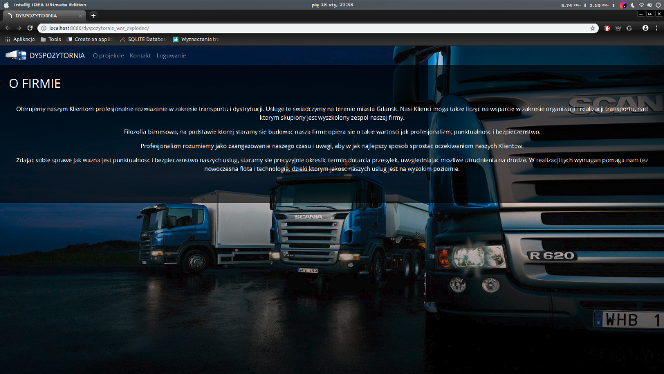
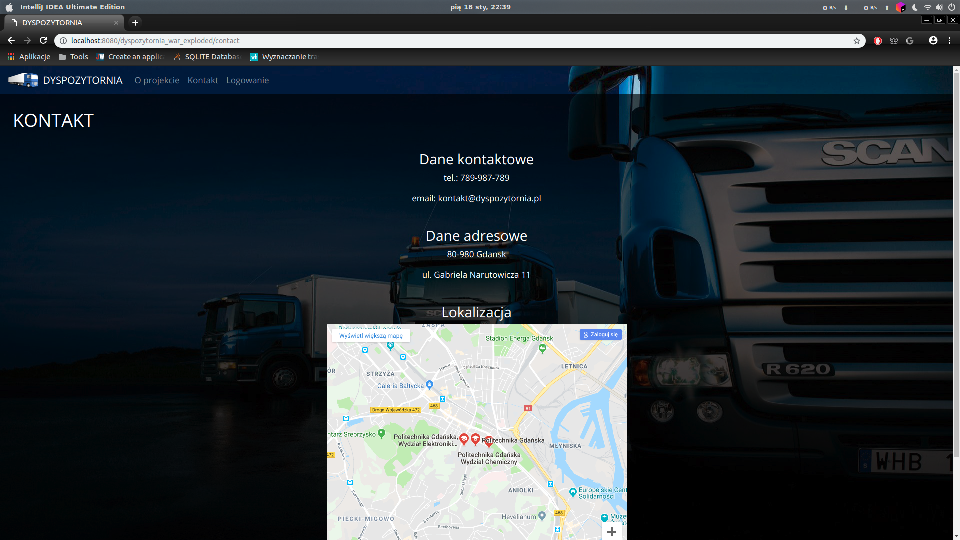
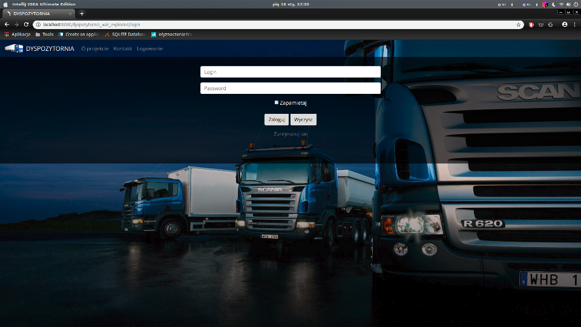
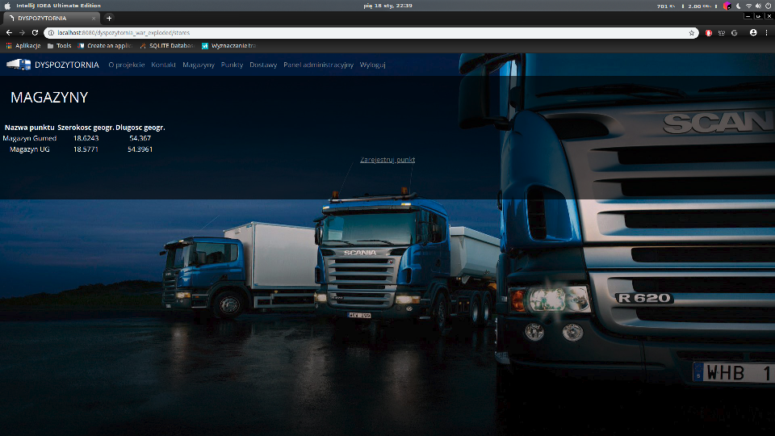
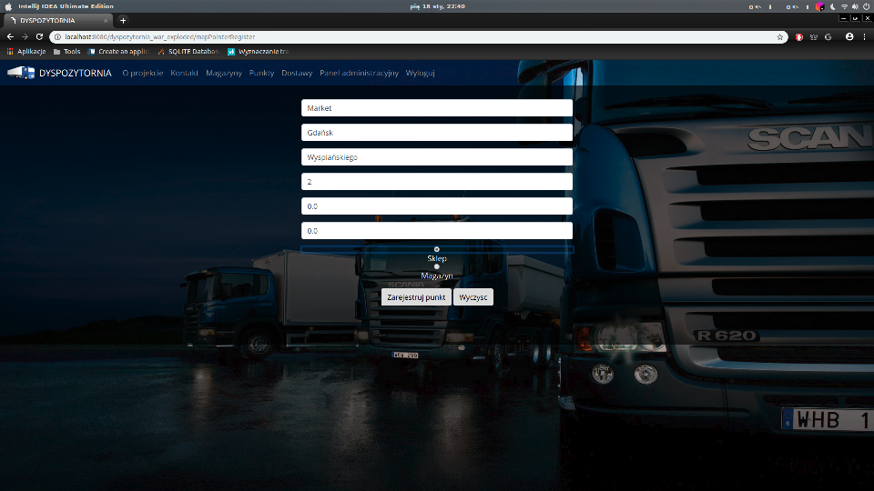

# MANAGING THE DELIVERY OF GOODS

### Description
Web application for managing the delivery of goods from warehouses to points of sale.

Used technologies and tools:
- Java Spring,
- Maven,
- MySQL,
- HTML, CSS, JavaScript,
- Bootstrap,
- Photoshop,
- Google Maps API,
- Git.

### Screenshots

